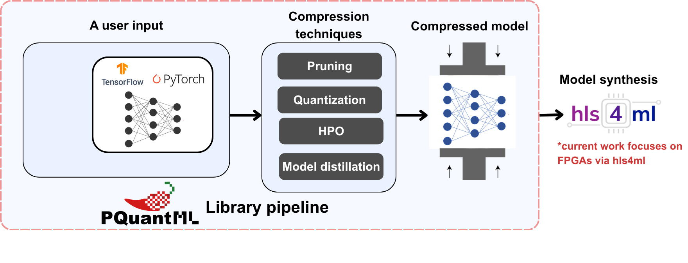
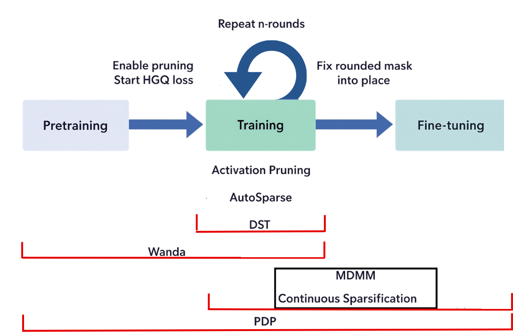

<p align="center">
  
</p>

# PQuantML

**PQuantML** is an end-to-end library for training compressed machine learning models, developed at CERN as part of the [Next Generation Triggers](https://nextgentriggers.web.cern.ch/t13/) project.

It supports:

- Joint pruning + quantization
- Layer-wise precision configuration
- Flexible training pipelines
- PyTorch and TensorFlow backends
- Knowledge distillation
- HGQ library integration
- Integration with hardware-friendly toolchains (e.g., [hls4ml](https://fastmachinelearning.org/hls4ml/))

PQuantML enables efficient deployment of compact neural networks on resource-constrained hardware such as FPGAs and embedded accelerators.

<p align="center">
  
</p>

## Installation

Install the base package via pip:

```bash
pip install pquant-ml
```

Install with a specific backend:

```bash
pip install "pquant-ml[tensorflow]"   # TensorFlow backend
pip install "pquant-ml[torch]"        # PyTorch backend
```

## Supported layers

| Layer | Description |
| --- | --- |
| `PQConv*D` | Convolutional layers |
| `PQAvgPool*D` | Average pooling layers |
| `PQBatchNorm*D` | Batch normalization layers |
| `PQDense` | Linear (fully connected) layer |
| `PQActivation` | Activation layers: ReLU, Tanh, Leaky ReLU, GELU, Hard Tanh, Softmax or a user-provided activation function (Torch only) |
| `MultiHeadAttention` | Multi-head attention layer |
| `LayerNorm` | Layer normalization layer (currently Torch only) |

## Training

Different pruning methods involve different training stages, such as pre-training and fine-tuning. PQuantML provides a generic training function: you supply your own training and validation functions along with the number of epochs, and PQuant handles the training loop while automatically triggering the appropriate stages for the chosen pruning method.
<p align="center">
  
</p>

## Quantization

PQuantML supports two quantization modes, each with several granularity options.

**Fixed-point quantization** (for weights):
- per-weight
- per-channel
- per-tensor

**HGQ (High Granularity Quantization):**
- per-weight
- per-tensor

## Example

Example notebooks are available in the [`examples/`](https://github.com/cern-nextgen/PQuantML/tree/main/examples) directory. It shows how to:

1. Create a Torch model and data loaders.
2. Create the training and validation functions.
3. Load a default configuration for a pruning method.
4. Train and compress the model by passing the configuration, model, and training/validation functions to PQuant's training function.
5. Build a custom quantization and pruning configuration for a given model (e.g. disabling pruning for some layers, or using different quantization bit-widths per layer).
6. Use the direct-layer and layer-replacement approaches.
7. Use the HPO platform.

## Documentation

Full documentation is available at [pquantml.readthedocs.io](https://pquantml.readthedocs.io/en/latest/).

## Citation

The framework is described in **PQuantML: A Tool for End-to-End Hardware-aware Model Compression** ([arXiv:2603.26595](https://arxiv.org/abs/2603.26595)).

If you use PQuantML in your work, please cite:

```bibtex
@article{niemi2026pquantml,
  title   = {PQuantML: A Tool for End-to-End Hardware-aware Model Compression},
  author  = {Niemi, Roope and Petrovych, Anastasiia and Das, Arghya and
             Lupi, Enrico and Sun, Chang and Danopoulos, Dimitrios and
             Helbing, Marlon Joshua and Liu, Mia and Kagan, Michael and
             Loncar, Vladimir and Pierini, Maurizio},
  journal = {arXiv preprint arXiv:2603.26595},
  year    = {2026}
}
```

## Authors

- Roope Niemi (CERN)
- Anastasiia Petrovych (CERN)
- Arghya Das (Purdue University)
- Enrico Lupi (CERN)
- Chang Sun (Caltech)
- Dimitrios Danopoulos (CERN)
- Marlon Joshua Helbing
- Mia Liu (Purdue University)
- Michael Kagan (SLAC National Accelerator Laboratory)
- Vladimir Loncar (CERN)
- Maurizio Pierini (CERN)
